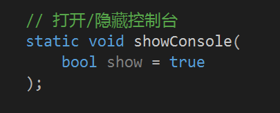

## Thanks for your coming!

Hey, guy! 

2018年5月27日，Easy2D v2.0.0-beta7 发布上线啦~ 诚邀志同道合的朋友参与 beta7 版本的测试工作！

你愿意抽出一点时间来帮助完善 Easy2D 吗？

不为任何事，仅仅是因为 I do what I like ！

这里没有工作计划！没有任务要求！没有 deadline ！

我们的目标是 —— 搞事搞事搞事！

## Guide

### 1. 我该如何参与测试？

由于 beta7 版本的入门教程需要重新编写，代码是否存在问题并不确定，目前 API 文档也还没有开始制作，所以我们非常需要你的帮助。

你可以通过以下几个方式来参与到 beta7 的开发中来：

- 先在官网学习 beta6 版本的开发过程，写几个小 demo ，最好可以读懂示例游戏中的代码
- 了解 beta7 和 beta6 之间的差异，慢慢将自己的 demo 转变为 beta7 版本
- 将官网中提供的 beta6 示例游戏代码，升级成有自己风格的 beta7 版本
- 选择一款你感兴趣的小游戏，尝试用 beta7 把它做出来（比如俄罗斯方块或者坦克大战）
- 学习过程中有任何问题，欢迎加群 608406540 交流

beta7 中也许隐藏着未知的 BUG，如果你遇到一些奇怪的问题，或者希望添加一个怎样的新功能，请到群里和大家交流。

<a class="ui primary button" href="/2018/05/25/easy2d-release-2-0-0-beta7/">查看 beta7 更新内容</a>

 

### 2. 我该如何熟悉 beta7 ？

由于没有 beta7 的完整教程和文档，所以暂时只能通过 **自行阅读** 头文件的方式来熟悉 beta7 的内容。

不要慌。。我在头文件中几乎对所有函数和参数都做了注释，阅读起来会比较简单。而且 Visual Studio 的强大功能可以帮助我们，你可以直接在头文件中搜索有没有你想要的功能（其实和直接看 API 文档差不多的感觉）。

Tips 

现在 E2D 的生态链几乎为 0，所以有任何问题不要去百度（百度不到的。。），请加群 608406540 进行讨论，我会在群里给出解释。群文件里还有一些官网找不到的 beta7 版本测试代码，可供参考。

虽然 beta7 和 beta6 的差异非常大，但是整个框架思路是不变的。beta6 中有的功能都可以在 beta7 中找到对应，只是可能有些函数名变了，有些函数的使用方式变了。

如果你对 beta6 比较熟悉，那么查看一下头文件中的函数注释，很容易就可以上手。

如果你之前完全不了解 Easy2D ，那最好从 beta6 开始学起，因为它的入门教程比较完善。官网由几个示例游戏的代码，里面都做了详细的注释，了解大概思路以后就可以开始 beta7 的学习了。

 

### 3. 不知道 beta7 中有哪些函数怎么办？

Easy2D 中的类是按照功能模块区分的，比如 `Game` 类可以控制游戏的初始化、开始、暂停、结束，`Window` 类可以控制窗口的大小、标题、图标，`Player` 类可以控制音乐的播放、停止、音量等等。

如果你想查看某一模块下还有什么功能，比如你想知道 `Window` 类还可以做哪些事，可以在 Visual Studio 中右键点击代码中的 Window ，再点击 `转到声明` ，就可以看到 Window 类的完整声明，所有的函数一览无余。

比如，你上下滚动代码，可以看到这么一个函数：

根据注释，你就可以知道这个函数可以打开或关掉控制台（写 C 语言时的那个黑框框），然后你就可以尝试在代码中使用它，测试它的功能。

## Community

与 Easy2D 相关的交流群有两个，欢迎大家加入

- Easy2D 学习交流群 608406540

- C/C++ 语言学习交流群 191334430

## Wishes

有些心里话，写在最后吧。

曾经 Easy2D 只是我的一个小小的想法，仅仅是为了让自己做游戏方便一点点，仅仅是因为对游戏开发单纯的热爱，从此 Github 中多了一个名叫 `Easy2D` 的仓库，里面有几百行幼稚的代码。

然而它不再是我一个人的代码，很多人会去学习使用它。我必须学着如何让大家用起来更舒服，让它散发出更强大的魅力，让它成为新手探索游戏开发世界的敲门砖。

经营一个框架真的需要耗费很大的精力。设计、开发、测试、官网建设、教程制作、示例代码... 要做的事情太多了，我想做的事情也太多了。

所以 Easy2D 的发展很缓慢，同时有很多人质疑它存在的意义。

然而这些对我来说都不重要，我从不是因为它有发展前景，或者它可以盈利，才去做的。我相信很多学习 Easy2D 的朋友也是这样的。

不为别的，I do because I want to.

Easy2D 从 2016 年 6 月诞生至今，经过了将近 2 年的探索与发展，感谢老同志的陪伴，也感谢今天的你对它的关注。
