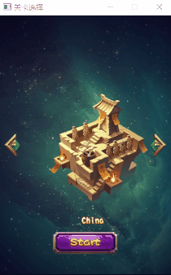
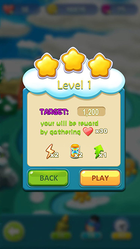

## 关于函数命名

Easy2D 按照以下规律命名函数：

- 所有函数都以小写字母开头，用大写字母区分后面的单词。如`App::createWindow`
- 获取对象的属性值：`get`+`属性名`。如`Image::getWidth`
- 修改对象的属性值：`set`+`属性名`。如`Text::setText`
- 获取对象的状态(bool值)：`is`+`状态名`。如`MouseMsg::isLButtonDown`
- 向对象添加子元素：`add`+`子元素类型`。如`Scene::add`
- 删除对象中的某个子元素：`del`+`子元素类型`。如`Timer::delTimer`
- 删除对象中所有子元素：`clearAll`+`子元素类型`。如`KeyMsg::clearAllListeners`
- 其他函数按照`动词`+`名语`形式命名。如`MusicUtils::playMusic`

<br/>


## 关于场景

`Easy2D`不建议直接使用`Scene`类加载场景，最好为每个场景都新建一个类，并继承`Scene`。

例如下面的测试场景：

```cpp
// TestScene.h

#pragma once
#include <easy2d.h>

class TestScene : public Scene
{
public:
	TestScene();
	~TestScene();
}
```

```cpp
// TestScene.cpp

TestScene::TestScene()
{
	// 在此处定义场景中的元素
}

TestScene::~TestScene()
{
}
```

这样使每个场景相对独立，不仅让代码更清晰，而且可以方便进行场景之间的切换。


<br/>


## 关于动画

`精灵(Sprite)`类可以执行你指定的一系列`动作(Action)`，例如一段平移或者一次透明度渐变，目前 Easy2D 支持的动作有以下几种：

- `ActionMoveBy` 相对位移动画
- `ActionMoveTo` 绝对位移动画
- `ActionOpacityBy` 透明度相对渐变动画
- `ActionOpacityTo` 透明度渐变动画
- `ActionScaleBy` 比例相对缩放动画
- `ActionScaleTo` 比例缩放动画
- `ActionFadeIn` 淡入动画
- `ActionFadeOut` 淡出动画
- `ActionFrames` 帧动画
- `ActionDelay` 一段延迟
- `ActionTwo` 让两个动作连续运行，执行一次
- `ActionSequence` 让多个动作连续运行
- `ActionNeverStop` 让一个动作循环执行
- `ActionCallback` 执行一个回调函数

想要使用这些动作你需要先创建一个 Sprite 对象：

```cpp
// 精灵类需要一张图片
auto img = new Image(_T("x.png"));
// 创建精灵类
auto sprite = new Sprite(img);
```

有了这个对象，我们就可以让它做我们想做的事，比如执行一次简单的平移动作

```cpp
// 创建一个坐标
CPoint point(100, 50);
// 创建一个持续 1.5s 的位移动画
auto moveAction = new ActionMoveTo(1.5, point);
// 让 sprite 执行这个动画
sprite->addAction(moveAction);
```

运行这段代码，sprite 将在 1.5s 内平移到窗口的（100，50）坐标处。

上面的代码还可以简写成一句：

```cpp
sprite->addAction(new ActionMoveTo(1.5, CPoint(100, 50)));
```

不同的动画需要不同的参数，例如 ActionTwo 动作则需要两个 Action 的指针作为参数：

```cpp
// 创建一个相对位移动画
auto action1 = new ActionMoveBy(1.5, CPoint(50, 50));
// 创建上一个动画的逆动画
auto action2 = action1->reverse();
// 将两个动画做成连续动画
auto action = new ActionTwo(action1, action2);
// 让 sprite 执行这个动画
sprite->addAction(action);
```

运行上面的代码，sprite 就会向右下方移动一段距离，然后返回原位。

注意不是所有动画都有逆动画，只有当这个动画是一个“相对”的动画时，它才能正确的产生逆动画，比如`ActionMoveBy`、`ActionOpacityBy`、`ActionScaleBy`、`ActionFrames`等。

精灵也可以同时进行两个动作，只需要把动作分别加入这个精灵：

```cpp
// 假设存在 action1 和 action2 两个动作
sprite->addAction(action1);
sprite->addAction(action2);
```

但是不允许一个动作同时被两个精灵执行，所以下面的代码是错误的

```cpp
// 下面的代码会导致动作混乱
sprite1->addAction(action);
sprite2->addAction(action);
```

应该使用动作的`copy`函数创建一个拷贝对象，再使用它

```cpp
sprite1->addAction(action);
sprite2->addAction(action->clone());
```

其实，利用`定时器(Timer)`也完全可以实现简单的动画，例如，想实现一个节点水平移动的动画，可以创建一个每 10ms 运行一次的定时器，每次将这个节点的位置移动一点点，代码如下：

```cpp
// 创建一个每 10ms 运行一次的定时器
Timer::addTimer(_T("Move"), 10, [=]() {
	node->move(1, 0);
});
```

想要停止这个动画时，将这个定时器移除即可。
```cpp
// 删除名称为 Move 的定时器
Timer::deleteTimer(_T("Move"));
```

如果想让这个节点运动到某个地方自动停止，可以用下面的方法实现：
```cpp
// 创建一个每 10ms 运行一次的定时器
Timer::addTimer(_T("Move"), 10, [=]() {
	// node 的横坐标超过 500 时，自动停止动画
	if (node->getX() < 500)
		node->move(1, 0);
	else 
		Timer::delTimer(_T("Move"));
});
```

<br/>

## 关于节点的合并

当场景中节点（元素）数量很少时，单独处理它们很方便。但是需要同时操作多个节点时，使用`BatchNode(合并节点)`或`Layer(图层)`就可以大大简化操作。

例如下面这个场景：



按下按钮同时移动多张图片，如果单独处理的话，需要计算每张图片的运动终点位置，实现起来很困难。

我们可以将所有的图片放入`BatchNode`中，根据它们之间的相对位置调整它们的坐标。

```cpp
auto img1 = new Image();
auto img2 = new Image();
auto img3 = new Image();

img1->setPos(0, 0);
img2->setPos(50, 0);    // 第二张图片在相对第一张图片右方 50 像素的地方
img3->setPos(100, 0);   // 第三张图片在相对第一张图片右方 100 像素的地方

// 创建一个合并节点
auto all = new BatchNode();
// 将三张图片都加入这个节点
all->add(img1);
all->add(img2);
all->add(img3);
// 移动这个合并节点时，三张图片会一起移动
all->setPos(200, 150);
```

`Layer`是图层的意思，它在`BatchNode`的基础上增加了阻塞消息的功能，若开启了阻塞，处于它下层的节点无法获取鼠标消息。

例如我们可以在下面的场景使用`Layer`，将这个弹出菜单中的节点全部放入`Layer`中，并且让它下层的所有按钮失效。



<br/>

## 关于回调函数

引擎中许多地方都要用到`回调函数(Callback)`，按下按钮要调用回调函数，检测按键要调用回调函数，定时器也是每过一段时间调用一次回调函数。

回调函数其实就是一个通过函数指针调用的函数，对比一下，我们平时调用函数是这样的：

```cpp
void main()
{
	printf("hello");
}
```

这是在 main 函数中直接调用了`printf`函数。而回调函数则是，提前告诉系统，遇到某个情况时，就调用特定的函数。

例如我们给按钮设定按下时的回调函数：

```cpp
auto btn = new TextButton(_T("按钮"));
btn->setClickedCallback(特定函数);
```

这句代码的意思就是告诉引擎，遇到按钮按下的情况时，就调用我给你的这个函数。

回调函数有多种使用形式，最普通的写法是直接传入函数名：

```cpp
// 按键回调函数
void onKeyDown(VK_KEY key);

// 使用这个函数添加按键监听
KeyMsg::addListener(_T("监听器名称"), onKeyDown);
```

这样引擎就会在有按键情况时，调用`onKeyDown`函数。这种写法只适用于普通函数，若要在类的成员函数中使用，则要用到`std::bind`工具：

```cpp
// 假设一个 TestScene
class TestScene : public Scene
{
public:
	void onButtonClick();
};
```

要使用`TestScene::onButtonClick`函数作为按钮按下时的回调函数，应使用下面的写法：

```cpp
button->setClickedCallback(std::bind(&TestScene::onButtonClick, this));
```

这样就将按钮按下和onButtonClick函数绑定在了一起。

不过上面这种写法不适用于所有情况，它在设置按钮和定时器回调函数时是生效的，因为它们都没有函数参数。但是在设置按键监听和鼠标监听回调函数时，需要为它指定额外的参数：

```cpp
// 假设一个 TestScene
class TestScene : public Scene
{
public:
	void onKeyDown(VK_KEY key);
};
```

要使用`TestScene::onKeyDown`函数作为按键监听的回调函数，应使用下面的写法：

```cpp
KeyMsg::addListener(_T("监听器名称"), std::bind(&TestScene::onKeyDown, this, std::placeholders::_1));
```

相比之前的写法，这个 bind 函数多了一个参数`std::placeholders::_1`，这是一个占位符，因为需要给`onKeyDown`函数传入一个`VK_KEY`类型的参数。想要了解 std::bind 的具体用法请查阅相关资料。

另外还有一种非常简便的方法，就是使用`Lambda函数`，这是一种匿名函数，完整的 Lambda函数由四部分组成`[方式] (函数参数) ->返回值类型 {函数体}`，例如：
```cpp
auto btn = new TextButton(_T("按钮"));
btn->setClickedCallback([]() {
	// 写下回调函数内容
});
```

C++ Lambda 函数是 C++11 实现的新特性，Easy2D 建议使用这种方法实现回调函数。

<br/>


<div class="ui center page-buttons"><a class="ui button page-left-btn" href="simple.html"><i class="ui angle left icon"></i>上一篇：简单示例</a><a class="ui button page-right-btn" href="more.html">下一篇：更多示例<i class="ui angle right icon"></i></a></div>

<br/>